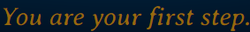
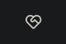
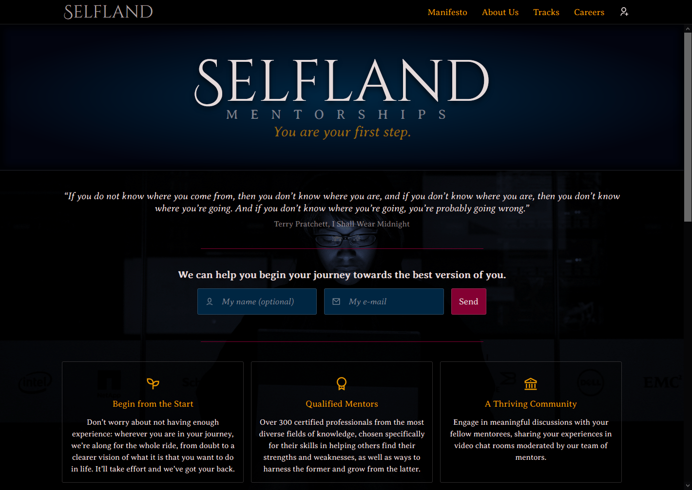

> Landing page created for the Expansion Week Challenge of Rocketseat’s
> GoStack Bootcamp 2020.

The task: present a soft skill I consider to be among the most important for a
developer. Given my history, there’s no other I could choose but _self-knowledge._

# The Content

The idea is that one must first find oneself to be able to truly achieve that of which they are capable. That is reflected in the slogan,

> _You are your first step._

The content is presented as a call to action from a fictitious mentorship service, inviting the user to embark on the journey of the betterment of themselves through proposed activities aimed at increasing the awareness they have of what makes them who they are.

# The Visual Language

## Typogaphy

- **Headings**: [Cinzel Decorative @ Google Fonts](https://fonts.google.com/specimen/Cinzel+Decorative)

  

- **Body copy**: [Averia Serif Libre @ Google Fonts](https://fonts.google.com/specimen/Averia+Serif+Libre)

  

- **Iconography**: [Remix Icon @ react-icons](https://react-icons.github.io/react-icons/icons?name=ri)

  

The desired tone for the page was one of austerity, authority, as a way to convey to the potential user that they would be safe in there, that they would be in good hands should they agree to subscribe to the services offered.

## The Color Palette

Neutral and cool background colors, with bold accents to draw the user’s attention.

| Color         |                             Swatch                              |   HEX    | Applications                                     |
| ------------- | :-------------------------------------------------------------: | :------: | ------------------------------------------------ |
| Rich Black    |  | #02040f; | Background                                       |
| Prussian Blue |  | #002642; | Background accents                               |
| Gainsboro     |  | #e5dada; | Main body copy, headers                          |
| Gamboge       |  | #e59500; | Links, section headers                           |
| Claret        |  | #840032; | Form limits, form action button, form user hints |

## Screenshot

---

Made with 💛 by [**yours truly**](https://www.linkedin.com/in/pedro-chaves-jr/).
